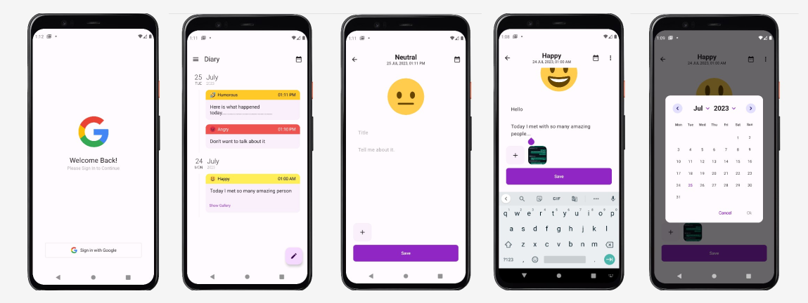

# PersonalDiaryApp
Multi-Module Android Journaling App created with Kotlin, Jetpack Compose, MongoDB, and Firebase
Diary / Journaling Android App
Single-Module : branch -> master
Multi-Module : branch -> multi-module

# Features :
1. Google Authentication
2. Create Diary
3. Change Diary
4. Delete Diary
5. Add Images to each Diary
6. Filter Diaries
7. Delete All Diaries

# Stack :
- Jetpack Compose ( Kotlin )
- MongoDB for User's data
- Firebase for storing images

# Screenshots 

